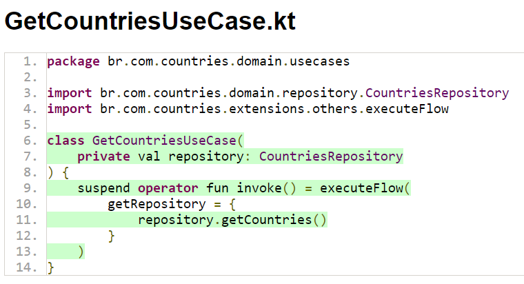

# Countries

>  Esse projeto mostra uma lista de países e algumas informações sobre cada país. 

Nesse projeto a construção principal do projeto foi construído com:

- Padrão MVVM
- Gerenciamento de dependências usando o buildSrc e Kotlin DSL (O projeto foi construído com a versão Giraffe do Android Studio. Essa versão do Android Studio vem como padrão o gerenciamento de dependências utilizando o Kotlin DSL)
- Injeção de Dependência
- Testes Unitários
- Uso de libraries para determinados contextos
- Construção de Custom View

As principais libraries utilizadas no projeto:

- Koin (Ele é usado para a injeção de dependência do projeto)
- Retrofit (Ele é usado para as chamadas da API que eu utilizo nesse projeto)
- Glide (Ele é usado para o carregamento das imagens vindo da API)
- FacebookShimmer (Ele é usado para mostrar o estado de carregamento da tela)
- AssertK e Mockk (Eles são usados nos testes unitários)
- Barista (Ele é usado para os testes de instrumentação)
- Jacoco (Ele é usado para gerar os relatórios de testes unitários do projeto)

Imagens do projeto:

|      |                       |
| --------------- | --------------------- |
| CountryActivity | CountryDetailActivity |

Relatório dos testes unitários:

|                         |                      |                               |                       |
| ----------------------- | ------------------ | --------------------------- | ------------------- |
| CountriesRepositoryImpl | CountriesViewModel | GetCountrySearchNameUseCase | GetCountriesUseCase |

